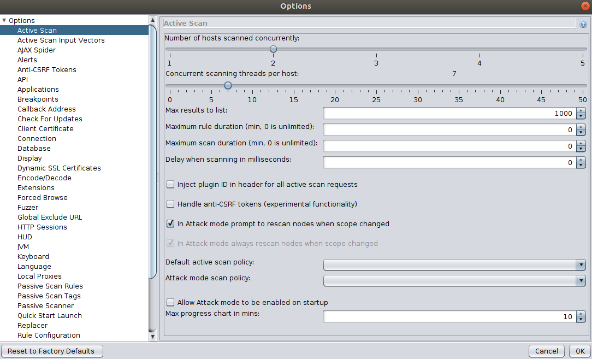
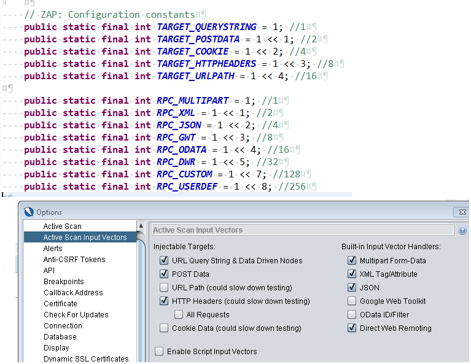

# Advanced Settings

The following section shows advanced configurations of the APIs.

## Spider Settings

The following image shows the advanced configurations tab of Spider in the desktop UI.

Use the [setOptionMaxDepth](#spideractionsetoptionmaxdepth) API to set the maximum depth the spider can crawl, where 0 refers to unlimited depth. 
The [setOptionMaxChildren](#spideractionsetoptionmaxchildren) API sets the maximum number of child nodes (per node) that can be crawled, 
where 0 means no limit. The [setOptionMaxDuration](#spideractionsetoptionmaxduration) API can be used to set the maximum duration the Spider will run.
Use the [setOptionMaxParseSizeBytes](#spideractionsetoptionmaxparsesizebytes) API to limit the amount of data parsed by the spider. 
This allows the spider to skip big responses/files. 

View the [Spider section](#spider) in the API Catalogue for additional APIs.

## Ajax Spider  Settings

The following image shows the advanced configurations tab of Ajax Spider in the desktop UI.

Similar to the Spider API, the Ajax spider also provides APIs to set the [maximum depth](#), [crawl state](#), and [maximum duration](#).

## Passive Scan Settings

The scanning rules can be enabled/disabled using the [enableScanners](#pscanactionenablescanners) and [disableScanners]((#pscanactiondisablescanners)) APIs.
Also use the [setScanOnlyInScope](#pscanviewscanonlyinscope) API to limit the passive scanning to a scope. View
the advanced section to learn how to configure a context or scope using ZAP APIs.

Passive scanning can also be used to automatically add tags and raise alerts for potential issues. A set of rules for 
automatic tagging are provided by default. These can be changed, deleted or added to via the Options Passive Scan Tags Screen.

## Active Scan Settings

### General Options

The general options for Active Scan can be configured using the options tab in the desktop UI shown below.

Use the [setOptionMaxScanDurationInMins](#ascanactionsetoptionmaxscandurationinmins) API to limit the duration of scan and 
[setOptionMaxRuleDurationInMins](#ascanactionsetoptionmaxruledurationinmins) API to limit the time of individual active scan rules.
This can be used to prevent rules from running for an excessive amount of time.

Use the [setOptionHostPerScan](#ascanactionsetoptionhostperscan) API to set the maximum number of hosts that will be scanned at the same time. 
Furthermore, use the [setOptionThreadPerHost](#ascanactionsetoptionthreadperhost) API to set the number of threads the scanner will use per host. 
Increasing both of these values will reduce the active scanning time but this may put extra strain on the server ZAP is running on.

Use the [setOptionDelayInMs](#ascanactionsetoptiondelayinms) API to delay each request from ZAP in milliseconds. Setting this to a non zero value will increase 
the time an active scan takes, but will put less of a strain on the target host. View the [Active Scan](#zap-api-ascan) section in 
the API Catalogue for additional information regarding the APIs.

### Input Vectors

Input vectors refers to the elements that Active Scan will target. Specifying the exact elements to target will improve the
scanning time and accuracy of the results. For example, for the following configuration the [optionTargetParamsInjectable](#ascanviewoptiontargetparamsinjectable) and 
[optionTargetParamsEnabledRPC](#ascanviewoptiontargetparamsenabledrpc) will yield the results of 11 and 39. 
The numbers can be deconstructed in the following manner:

- 1+2+9 = 11 [Query String(1), Post Data(2), HTTP Headers(0)]
- 1+2+4+32 = 39 [Multipart (1), XML (2), JSON (4), DWR (32)]
 

Thus, to change the values of `Injectable targets` and `Input Vector Handlers` calculate the exact values and 
use the [setoptiontargetparamsinjectable](#ascanactionsetoptiontargetparamsinjectable) and [setoptiontargetparamsenabledrpc](#ascanactionsetoptiontargetparamsenabledrpc) APIs accordingly.

The `Add URL query parameter` option under the `Injectable Tragets` sets whether or not the active scanner should add a query param 
to GET requests which do not have parameters to start with. This option can be enable using the [setoptionaddqueryparam](#ascanactionsetoptionaddqueryparam) API.

### Technology

The Technology tab allows you to specify which types of technologies to scan. Un-selecting technologies that you know are 
not present in the target application may speed up the scan, as rules which target that technology can skip those tests.
For an example, if the target web application does not have a database then removing it will increase the performance of the Active Scan.

Use the [includeContextTechnologies](#contextactionincludecontexttechnologies) and [excludeContextTechnologies](#contextactionexcludecontexttechnologies) 
API endpoints to include and exclude the technology list from the context.

### Policy

A scan policy defines exactly which rules are run as part of an active scan. It also defines how these rules run influencing 
how many requests are made and how likely potential issues are to be flagged. You can define as many scan policies as you 
like and select the most appropriate one when you start the scan via the Active Scan. 

The Policy tab shown in the above image allows you to override any of the settings specified in the selected scan policy.
